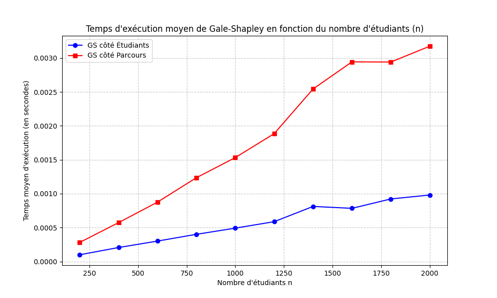
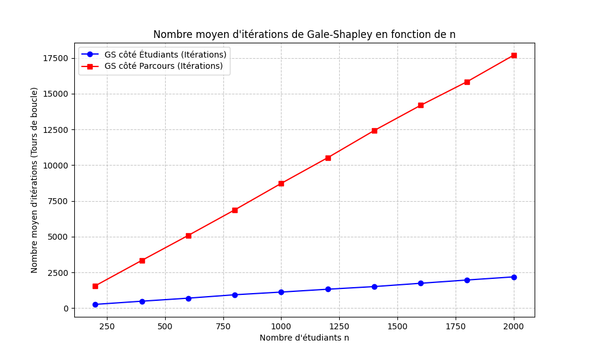

# TME - semaines 1 à 3

## Introduction et présentation du projet
**Reformulation du sujet :**
L'objectif de ce projet est d'étudier et d'implémenter des algorithmes d'affectation centralisée visant à répartir des étudiants dans des parcours de Master. Nous analysons tout d'abord l'algorithme de Gale-Shapley (orienté étudiants puis parcours) pour garantir la **stabilité** des mariages. Dans un second temps, nous utilisons la programmation linéaire en nombres entiers (PLNE) via le solveur Gurobi pour explorer d'autres paradigmes d'affectation basés sur les scores de Borda, en optimisant soit **l'équité** (max-min), soit **l'efficacité** (somme des utilités).

**Architecture du code et jeux d'essais :**
Le projet est centralisé dans le fichier principal `main.py`, qui contient l'ensemble des algorithmes et modèles mathématiques. 
* **Les fonctions principales** : `gale_shapley_etudiants` et `gale_shapley_parcours` (Partie 1), les générateurs aléatoires `generer_CE` et `generer_CP` (Partie 2), et les modèles d'optimisation `Q11_gurobi`, `Q12_gurobi`, `Q14_gurobi` (Partie 3).
* **Les jeux d'essais** : Pour valider nos algorithmes, nous utilisons les fichiers statiques `PrefEtu.txt` (13 étudiants) et `PrefSpe.txt` (10 masters) pour les parties 1 et 3. Pour la partie 2 (tests de montée en charge), nous avons implémenté des générateurs de permutations aléatoires permettant de simuler des cohortes allant de 200 à 2000 étudiants.

---

## 1 Problème et affectation:

### Q1. Lecture des fichiers et extraction des matrices $C_E$ et $C_P$
Pour cette première étape, nous avons implémenté deux fonctions distinctes permettant de parser les fichiers textes fournis et de construire les matrices de préférences $C_E$ (étudiants) et $C_P$ (parcours).
* **Structure de données** : Nous avons fait le choix de représenter les matrices $C_E$ et $C_P$ sous la forme de listes de listes en Python. Ainsi, accéder aux préférences de l'étudiant $i$ se fait en temps constant $O(1)$ via l'instruction *``CE[i]``*, qui retourne la liste ordonnée de ses vœux.
* **Traitement du parsing** : Pour le fichier *``PrefEtu.txt``*, nous ignorons la première ligne d'en-tête contenant le nombre total d'étudiants. Pour le fichier *``PrefSpe.txt``*, nous ignorons les deux premières lignes qui contiennent respectivement le nombre d'étudiants et les capacités d'accueil des parcours.
* **Nettoyage des données** : Lors de la lecture ligne par ligne, nous utilisons la méthode *``split()``* pour isoler chaque élément. Nous ignorons systématiquement les deux premières colonnes (l'indice numérique et le label sous forme de chaîne de caractères, par exemple "Etu0" ou "AI2D") pour ne conserver que les identifiants numériques des choix, que nous castons explicitement en entiers (int) afin de pouvoir les manipuler lors de l'algorithme de Gale-Shapley.

### Q2. Choix et justification des structures de données pour l'algorithme de Gale-Shapley
Pour garantir une complexité optimale de l'algorithme de Gale-Shapley (idéalement $O(n \times m)$ dans notre cas asymétrique, avec $n$ étudiants et $m$ parcours), il est impératif de réduire la complexité temporelle de chaque opération interne à $O(1)$ ou s'en approchant. Voici les structures de données que nous avons choisies :
1. **Trouver un étudiant libre à chaque itération** :        
        --> *``Structure``* : Une liste utilisée comme une Pile (LIFO) ou une File (FIFO), contenant initialement les identifiants de tous les étudiants.        
        --> *``Complexité``* : L'ajout (si un étudiant est rejeté) et le retrait (pour traiter un étudiant libre) s'effectuent en temps constant $O(1)$. La complexité spatiale est de $O(n)$.

2. **Trouver le prochain parcours à qui faire une proposition** :           
        --> *``Structure``* : Un tableau d'entiers prochain_choix de taille $n$, initialisé à 0. L'index représente l'étudiant, et la valeur correspond à l'index de son prochain choix dans sa liste de préférences $C_E$.          
        --> *``Complexité``* : La consultation et l'incrémentation de cette valeur se font en $O(1)$. Cela évite de modifier la matrice $C_E$. Complexité spatiale : $O(n)$.

3. **Trouver la position de l'étudiant $i$ dans le classement du parcours $j$** :                 
        --> *``Structure``* : Une matrice des rangs $R_P$ (inverse de $C_P$). Cette matrice de dimensions $m \times n$ est précalculée avant de lancer l'algorithme. La case $R_P[j][i]$ contient le rang (entier) de l'étudiant $i$ selon le parcours $j$       
        --> *``Complexité``* : Le précalcul coûte $O(m \times n)$ en temps, mais une fois créé, l'accès au rang en cours d'algorithme se fait en temps constant $O(1)$. Sans cela, la recherche aurait coûté $O(n)$ à chaque proposition. La complexité spatiale est de $O(m \times n)$.

4. et 5. **Trouver l'étudiant le moins préféré et le remplacer** :                
        --> *``Structure``* : Pour chaque parcours, nous maintenons les étudiants actuellement affectés dans un Tas (Heap), et plus spécifiquement une file de priorité implémentée sous forme de Max-Heap.La priorité de chaque étudiant dans le tas est définie par son rang selon le parcours (obtenu en $O(1)$ via la matrice précalculée $R_P$). L'étudiant le moins préféré (celui ayant le rang numérique le plus élevé) est ainsi toujours maintenu à la racine du tas.               
        --> *``Complexités``* :                
                * **Trouver le moins préféré (Opération 4)** : L'accès à la racine du tas se fait en temps constant $O(1)$.          
                * **Remplacer un étudiant (Opération 5)** : Remplacer consiste à extraire l'élément à la racine (l'étudiant rejeté) et à insérer le nouvel étudiant. Ces deux opérations de maintien de la structure de tas s'effectuent en $O(\log C)$, où $C$ est la capacité du parcours.

### Q3. Implémentation et analyse de la complexité de Gale-Shapley "côté étudiants"
L'algorithme a été implémenté en se basant sur les structures de données qu'on a justifiées à la question précédente.

**Logique d'implémentation :**     
1. Nous calculons au début une matrice des rangs $R_P$ à partir de $C_P$.
2. Une pile (*``libres``*) gère les étudiants sans affectation qu'on a décrit comme libre.
3. Pour chaque proposition d'un étudiant $i$ à un parcours $j$, le parcours compare le rang de $i$ (récupéré en $O(1)$ via $R_P$) avec le rang de son "pire" étudiant actuellement affecté. Ce dernier est toujours situé à la racine du Max-Heap gérant les affectations du parcours $j$.
4. Si l'étudiant proposant est meilleur, il remplace le pire étudiant du tas, et ce dernier est réinséré dans la pile libres pour qu'il soit traité dans le prochain tour de boucle.

**Analyse de la complexité :**    
Soit $n$ le nombre d'étudiants, $m$ le nombre de parcours, et $C$ la capacité maximale d'un parcours.

* **Complexité temporelle : $\mathcal{O}(n \cdot m \cdot \log C)$**
        --> Le précalcul de la matrice $R_P$ nécessite de parcourir toutes les préférences des masters, soit $\mathcal{O}(m \cdot n)$.      
        --> Dans le pire des cas, chaque étudiant peut faire une proposition à chaque master. Le nombre maximal de propositions est donc de $n \times m$.         
        --> À chaque itération (proposition), extraire un étudiant libre, trouver son prochain choix et consulter son rang se font en $\mathcal{O}(1)$.         
        --> Si le parcours accepte l'étudiant, l'insertion (et l'éventuelle suppression du pire étudiant) dans le Max-Heap prend $\mathcal{O}(\log C)$.         
        --> La boucle principale s'exécute donc en $\mathcal{O}(n \cdot m \cdot \log C)$. La complexité totale est par conséquent dominée par $\mathcal{O}(n \cdot m \cdot \log C)$. (Mais comme dans notre cas $C \le 2$, $\log C$ est une constante négligeable, la complexité devient $\mathcal{O}(n \cdot m)$).   
        
* **Complexité spatiale : $\mathcal{O}(n \cdot m)$**
        --> Les matrices $C_E$, $C_P$ et $R_P$ occupent chacune un espace $\mathcal{O}(n \cdot m)$.               
        --> Les structures utilitaires (*``libres``*, *``prochain_choix``*) prennent $\mathcal{O}(n)$.              
        --> Les listes de tas stockant les affectations prennent un espace total proportionnel à la somme des capacités, soit $\mathcal{O}(n)$.              
        --> L'espace mémoire globale de notre algorithme est donc bornée par $\mathcal{O}(n \cdot m)$.

### Q4. Adaptation de Gale-Shapley "côté parcours"
1. **Logique de l'adaptation :**
Comme indiqué dans le cours, cette version inversée de l'algorithme "Proposer et Rejeter" permet de trouver l'affectation "hôpital-optimale" (ici parcours-optimale) au lieu de l'affectation "interne-optimale". Dans cette configuration, un master (qui possède une capacité $C$) continue de formuler des propositions tant qu'il a des places vacantes. Un étudiant (qui n'a qu'une seule place) accepte la première offre, puis ne la quitte que s'il reçoit une proposition d'un master qu'il préfère strictement.

2. **Structures de données optimisées :**
* **Matrice des rangs des étudiants ($R_E$) :** Inverse de la matrice $C_E$, calculée au démarrage en $O(n \times m)$. Elle permet à un étudiant, lors d'une nouvelle proposition, de comparer le rang du nouveau parcours avec celui de son parcours actuel en temps constant $O(1)$.
* **File *``masters_actifs``* :** Contient les parcours ayant des places disponibles. L'ajout et l'extraction se font en $O(1)$.
* **Tableaux d'états :** *``prochain_choix``* gère l'avancement dans les listes de préférences des parcours, *``places_prises``* gère le remplissage des capacités, et *``affectation_etudiant``* mémorise le parcours actuel de chaque étudiant. Tous offrent un accès et une modification en $O(1)$. Il n'y a plus besoin de structure de Tas (Heap) asymétrique car l'étudiant ne stocke qu'une seule affectation.

3. **Complexité :**
* **Temporelle : $O(n \times m)$**
Le précalcul de $R_E$ prend $O(n \times m)$. Dans la boucle principale, chaque parcours propose au maximum une fois à chaque étudiant, limitant le nombre total d'itérations à $n \times m$. Toutes les opérations internes (comparaison $R_E$, mises à jour des tableaux, gestion de la file) coûtant $O(1)$, la complexité totale est de $O(n \times m)$.
* **Spatiale : $O(n \times m)$**
Dominée par le stockage de la matrice $R_E$ et des listes de préférences. Les tableaux d'état n'occupent qu'un espace $O(n + m)$.

### Q5. Application des algorithmes sur les instances de test
Nous avons exécuté nos deux implémentations de l'algorithme de Gale-Shapley sur les instances fournies (*``PrefEtu.txt``* et *``PrefSpe.txt``*), en paramétrant le vecteur de capacités des $m=10$ parcours : $C = [2, 1, 1, 1, 2, 1, 1, 1, 1, 2]$. (La somme des capacités est de 13, ce qui correspond exactement au nombre d'étudiants).

Résultats obtenus :
* **Affectation GS côté Étudiants :**                 
Parcours  0 a recruté les étudiants : [12, 5]               
Parcours  1 a recruté les étudiants : [4]             
Parcours  2 a recruté les étudiants : [9]          
Parcours  3 a recruté les étudiants : [8]         
Parcours  4 a recruté les étudiants : [11, 10]           
Parcours  5 a recruté les étudiants : [0]         
Parcours  6 a recruté les étudiants : [1]        
Parcours  7 a recruté les étudiants : [7]         
Parcours  8 a recruté les étudiants : [6]           
Parcours  9 a recruté les étudiants : [2, 3]          

* **Affectation GS côté Parcours :**             
Parcours  0 a recruté les étudiants : [5, 12]           
Parcours  1 a recruté les étudiants : [4]         
Parcours  2 a recruté les étudiants : [9]            
Parcours  3 a recruté les étudiants : [8]            
Parcours  4 a recruté les étudiants : [10, 11]            
Parcours  5 a recruté les étudiants : [0]          
Parcours  6 a recruté les étudiants : [1]         
Parcours  7 a recruté les étudiants : [7]         
Parcours  8 a recruté les étudiants : [6]         
Parcours  9 a recruté les étudiants : [2, 3]         

### Q6. Vérification de la stabilité des affectations
Pour vérifier la validité de nos algorithmes, nous avons implémenté un vérificateur qui s'appuie strictement sur la définition d'une paire instable vue en cours : une affectation n'est pas stable s'il existe une paire (Étudiant $i$, Parcours $j$) telle que l'étudiant $i$ préfère le parcours $j$ à son affectation courante, et que le parcours $j$ préfère l'étudiant $i$ à au moins l'un de ses étudiants actuellement affectés.

**Implémentation du vérificateur :**
Notre méthode *``paires_instables(affectation, CE, CP)``* suit la logique suivante :
1. Elle calcule les matrices de rangs $R_E$ et $R_P$ pour évaluer les préférences en temps constant $O(1)$.          
2. Pour chaque étudiant, elle isole l'ensemble des parcours qu'il préfère strictement à son affectation courante.          
3. Pour chacun de ces parcours cibles, elle identifie l'étudiant "le moins préféré" actuellement affecté (celui ayant le pire rang selon $R_P$).            
4. Elle compare le rang de l'étudiant évalué avec celui de ce "pire" étudiant. Si le parcours préfère le nouvel étudiant, la paire est déclarée instable.        

**Résultats et validation :**
En passant les résultats obtenus à la Question 5 dans ce vérificateur, nous obtenons les retours suivants de la console :
* *``Paires instables (GS Étudiants) : 0 -> []``*
* *``Paires instables (GS Parcours)  : 0 -> []``*               

Ces listes vides prouvent de manière empirique que les deux variantes de l'algorithme de Gale-Shapley implémentées aux questions 3 et 4 fonctionnent correctement sur cette instance et retournent bien des mariages parfaitement stables.

## 2 Évolution du temps de calcul

### Q7. Génération de matrices de préférences aléatoires
Pour évaluer la montée en charge de nos algorithmes, nous avons implémenté deux générateurs d'instances aléatoires. Afin de rendre le code modulable, nous avons ajouté le nombre de parcours $m$ en paramètre avec 9 comme valeur par défaut.

* **Matrice $C_E$ (Étudiants) :** La fonction `generer_CE(n, m)` crée une liste de $n$ listes. Pour chaque étudiant, nous utilisons la fonction `random.sample(range(m), m)` de la bibliothèque standard de Python. Cela génère une permutation aléatoire uniforme des entiers de $0$ à $m-1$, représentant les préférences de l'étudiant, en temps $O(m)$. La complexité totale de la génération est donc en $\mathcal{O}(n \times m)$.
* **Matrice $C_P$ (Parcours) :** De manière symétrique, la fonction `generer_CP(n, m)` crée une liste de $m$ listes. Pour chaque parcours, nous générons une permutation aléatoire des entiers de $0$ à $n-1$ via `random.sample(range(n), n)`, ce qui s'effectue en temps $O(n)$. La complexité totale est également en $\mathcal{O}(n \times m)$.

Ces deux fonctions renvoient des structures de données strictement identiques (des listes de listes) à celles produites par nos fonctions de parsing de la Question 1. Ainsi, elles sont directement compatibles avec nos implémentations de l'algorithme de Gale-Shapley (Q3 et Q4).

### Q8. Mesures expérimentales du temps de calcul
Pour analyser le comportement pratique de nos algorithmes face au passage à l'échelle, nous avons mis en place une campagne d'expérimentation avec le protocole suivant :

* **Variation de la taille de l'instance** : Nous avons fait varier le nombre d'étudiants $n$ de **200 à 2000** par pas de 200, tout en gardant le nombre de parcours $m$ fixé à 9.
* **Génération des capacités** : Pour chaque valeur de $n$, nous avons réparti les capacités de manière équilibrée et déterministe. Chaque parcours reçoit une capacité de base de $n \div 9$ (division entière), et le reste (modulo) est distribué unité par unité sur les premiers parcours afin que la somme totale des capacités vaille exactement $n$.
* **Robustesse de la mesure** : Nous avons généré 10 instances aléatoires distinctes pour chaque valeur de $n$. Le temps retenu et affiché sur la courbe est la **moyenne des 10 exécutions**, mesurée grâce à la fonction haute précision `time.perf_counter()` de Python qui contrairement à `time.time()`, cette fonction est conçue spécifiquement pour mesurer des performances d'exécution (en nanosecondes). C'est beaucoup plus précis sur des algorithmes rapides.

**Résultats obtenus :**

### Q9. Analyse de la complexité observée
**1. Observation empirique (Lecture du graphique) :**                
Sur le graphique généré à la question précédente, nous observons que le temps de calcul moyen pour les deux variantes de l'algorithme croît de manière strictement proportionnelle au nombre d'étudiants $n$. Concrètement, lorsque la taille de l'instance double (par exemple en passant de $n=500$ à $n=1000$), le temps d'exécution double également. Sur un graphique, cette croissance proportionnelle se traduit par des lignes droites. Cela caractérise visuellement et empiriquement une **complexité linéaire**, notée $\mathcal{O}(n)$.

**2. Cohérence avec l'analyse théorique :**            
Ce comportement pratique valide parfaitement notre analyse mathématique théorique. En effet, nous avons établi aux questions 3 et 4 que la complexité temporelle théorique de nos algorithmes était de $\mathcal{O}(n \times m)$ dans le pire des cas, en considérant le coût des opérations internes (comme l'insertion dans un tas de petite taille) comme asymptotiquement négligeable.

L'apparente contradiction entre la théorie $\mathcal{O}(n \times m)$ et la pratique $\mathcal{O}(n)$ s'explique par notre protocole expérimental :
* Dans nos tests, nous faisons varier $n$ (de 200 à 2000), mais le nombre de parcours $m$ reste une **constante fixée à 9**.
* La complexité théorique pour cette expérience devient donc $\mathcal{O}(n \times 9)$.
* En notation asymptotique (Grand O), les constantes multiplicatives sont ignorées car elles ne modifient pas l'allure générale de la courbe de croissance. Mathématiquement, $\mathcal{O}(9n)$ équivaut strictement à $\mathcal{O}(n)$.

La théorie prédisait donc une ligne droite pour un nombre de parcours fixe, ce qui est exactement ce que l'expérience nous démontre.

**3. Analyse de la différence de pente (La constante cachée) :**               
Bien que les deux courbes soient des droites de complexité linéaire, nous remarquons que la courbe rouge (algorithme "côté parcours") possède une pente plus raide que la courbe bleue (algorithme "côté étudiants"). Elle prend un peu plus de temps pour traiter le même nombre d'étudiants.

Cela s'explique par la **constante cachée** de la notation $\mathcal{O}(n)$. En réalité, le temps d'exécution est $T(n) = c \times n$. Ici, la constante $c$ (le temps de traitement de base pour un étudiant) est plus élevée dans la version "parcours" à cause de la logique de l'algorithme:

* **Dans la version "côté étudiants"** : Un étudiant ne recherche qu'une seule affectation. Une fois accepté, il ne retourne dans la boucle d'affectation que s'il est explicitement remplacé par un meilleur candidat.
* **Dans la version "côté parcours"** : Les parcours doivent remplir des capacités d'accueil $C_i$ importantes [cite: 1, 457] (en moyenne $C \approx n/9$, soit plus de 220 places pour $n=2000$). À chaque fois qu'un seul de ces étudiants reçoit une meilleure offre ailleurs, le master perd une place, redevient "incomplet", et doit obligatoirement retourner dans la file d'attente (la pile `masters_actifs`) pour formuler de nouvelles propositions.

Ce phénomène de "va-et-vient" continu pour combler les places libérées génère un nombre de ré-itérations bien plus important, ce qui se traduit par une pente plus forte sur le graphique, tout en conservant une croissance globalement linéaire.

### Q10. Analyse du nombre d'itérations
**1. Protocole expérimental :**
Pour éviter les contrqintes matérielles (puissance du processeur, gestion de la mémoire par l'OS) qui peuvent légèrement modifier les mesures de temps en secondes, nous avons adapté nos algorithmes pour compter le nombre strict de tours de la boucle `while` (les itérations). Nous avons relancé le même protocole de test (variation de $n$ de 200 à 2000, $m=9$, et moyenne sur 10 instances aléatoires).

**2. Résultats obtenus :**

**3. Cohérence avec l'analyse théorique :**
L'allure de ce graphique est identique à celle du temps d'exécution (Q8) : nous obtenons des lignes parfaitement droites, confirmant une croissance linéaire $\mathcal{O}(n)$. Ce résultat est d'une cohérence absolue avec la théorie vue en cours.

Dans le cas général de l'algorithme de Gale-Shapley, il est établi qu'à chaque itération, une proposition unique est formulée. L'algorithme se termine nécessairement lorsque toutes les propositions possibles ont été épuisées. 
Dans notre variante asymétrique :
* **GS côté étudiants** : Chaque étudiant peut proposer au maximum à $m$ parcours. Le nombre d'itérations est borné par $n \times m$.
* **GS côté parcours** : Chaque parcours peut proposer au maximum à $n$ étudiants. Le nombre d'itérations est borné par $m \times n$.

Puisque $m$ est maintenu constant à 9 dans nos expérimentations, la borne supérieure du nombre d'itérations devient $9n$. La théorie garantit donc que le nombre d'itérations croît de manière proportionnelle à $n$, ce que confirme le résultat de notre graph. La différence de hauteur entre la courbe rouge et la bleue s'explique à nouveau par les fortes capacités des parcours ($C \approx n/9$) qui génèrent mécaniquement plus de rejets et donc plus de propositions que les étudiants qui ne cherchent qu'une seule place.

## 3  Equité et PL(NE) :

### Q11. Modélisation PLNE pour l'équité (Maximiser l'utilité minimale)
**1. Variables de décision :**
* $x_{i,j} \in \{0, 1\}$ : Vaut 1 si l'étudiant $i$ est affecté au parcours $j$, 0 sinon.
* $z$ : L'utilité minimale parmi tous les étudiants (basée sur le score de Borda).

**2. Fonction objectif :**
$$\max z$$

**3. Contraintes :**

* **Affectation unique** (Chaque étudiant est affecté à exactement un parcours) :
$$\forall i \in \{0, \dots, 12\}, \quad \sum_{j=0}^{9} x_{i,j} = 1$$

* **Capacités des parcours** (Le nombre d'étudiants ne doit pas dépasser la capacité $C_j$) :
$$\forall j \in \{0, \dots, 9\}, \quad \sum_{i=0}^{12} x_{i,j} \leq C_j$$

* **Linéarisation de l'utilité minimale** ($z$ doit être inférieur ou égal à l'utilité de chaque étudiant) :
$$\forall i \in \{0, \dots, 12\}, \quad z \leq \sum_{j=0}^{9} u_{i,j} \cdot x_{i,j}$$

---

### Q12. Modélisation PLNE pour l'efficacité (Maximiser la somme des utilités)
**1. Utilités (Score de Borda) :**
* $u_{E}(i, j) = 10 - \text{rang}_E(i, j)$ : Utilité de l'étudiant $i$ pour le parcours $j$.
* $u_{P}(j, i) = 13 - \text{rang}_P(j, i)$ : Utilité du parcours $j$ pour l'étudiant $i$.

**2. Variables de décision :**
* $x_{i,j} \in \{0, 1\}$ : Vaut 1 si l'étudiant $i$ est affecté au parcours $j$, 0 sinon.

**3. Fonction objectif (Maximiser la somme des utilités globales) :**
$$\max \sum_{i=0}^{12} \sum_{j=0}^{9} \left( u_{E}(i, j) + u_{P}(j, i) \right) \cdot x_{i,j}$$

**4. Contraintes :**
* **Affectation unique** (Chaque étudiant est affecté à un seul parcours) :
$$\forall i \in \{0, \dots, 12\}, \quad \sum_{j=0}^{9} x_{i,j} = 1$$
* **Capacités des parcours** (Respect de la capacité $C_j$) :
$$\forall j \in \{0, \dots, 9\}, \quad \sum_{i=0}^{12} x_{i,j} \leq C_j$$

Après avoir résolu le modèle avec le solveur Gurobi, nous obtenons les résultats suivants pour l'affectation maximisant l'efficacité globale :

* **Utilité moyenne des étudiants :** 8,77 
* **Utilité minimale observée :** 5 
    * *Note :* L'utilité minimale de 5 correspond à l'étudiant 11, qui a été affecté à son 6ème vœu (Parcours 3 - IMA).
* **Somme totale des utilités (Étudiants + Parcours) :** 239,0 

**Observation :**
L'utilité moyenne obtenue (8,77) est élevée, ce qui confirme que le modèle a réussi son objectif d'efficacité globale (maximisation de la somme des scores de Borda). Cependant, on note qu'en privilégiant la satisfaction collective, certains étudiants peuvent se retrouver avec un rang d'affectation moins favorable (comme l'étudiant 11 avec son 6ème choix), contrairement à l'approche de Gale-Shapley qui privilégie la stabilité.

---

### Q13. Modélisation PLNE avec garantie de rang $k$ (Efficacité sous contrainte)
**1. Variables de décision et Fonction objectif :**
* Identiques à la Q12. 
$$\max \sum_{i=0}^{12} \sum_{j=0}^{9} \left( u_{E}(i, j) + u_{P}(j, i) \right) \cdot x_{i,j}$$

**2. Contraintes :**
* **Affectation unique** et **Capacités des parcours** (Identiques à la Q12) :
$$\forall i \in \{0, \dots, 12\}, \quad \sum_{j=0}^{9} x_{i,j} = 1$$
$$\forall j \in \{0, \dots, 9\}, \quad \sum_{i=0}^{12} x_{i,j} \leq C_j$$
* **Garantie du Top $k$ :** Pour qu'un étudiant ait l'un de ses $k$ premiers choix, l'utilité de son affectation doit être supérieure ou égale à $10 - k$ (puisque $m=10$).
$$\forall i \in \{0, \dots, 12\}, \quad \sum_{j=0}^{9} u_{E}(i, j) \cdot x_{i,j} \geq 10 - k$$

---

### Q14. Résolution avec Gurobi (Recherche du plus petit $k$)
En exécutant le modèle itérativement, le solveur Gurobi a déterminé que **le plus petit $k$ permettant d'obtenir une affectation valide est $k=4$**.

**Affectation obtenue ($k=4$) :**
* Étudiant  0 affecté au parcours 8 (Son choix n°5)
* Étudiant  1 affecté au parcours 5 (Son choix n°2)
* Étudiant  2 affecté au parcours 4 (Son choix n°1)
* Étudiant  3 affecté au parcours 9 (Son choix n°1)
* Étudiant  4 affecté au parcours 1 (Son choix n°1)
* Étudiant  5 affecté au parcours 9 (Son choix n°2)
* Étudiant  6 affecté au parcours 7 (Son choix n°2)
* Étudiant  7 affecté au parcours 0 (Son choix n°2)
* Étudiant  8 affecté au parcours 6 (Son choix n°3)
* Étudiant  9 affecté au parcours 2 (Son choix n°1)
* Étudiant 10 affecté au parcours 3 (Son choix n°5)
* Étudiant 11 affecté au parcours 4 (Son choix n°2)
* Étudiant 12 affecté au parcours 0 (Son choix n°1)

**Analyse des résultats :**
* **Utilité totale (Étudiants + Parcours) :** 227.0
* Grâce à cette contrainte, les étudiants les moins bien obtiennent au pire leur 5ème choix, ce qui empêche les situations rencontrées à la Q12.

---

### Q15. Comparaison et analyse des différentes solutions
| Algorithme / Modèle | Stabilité (Paires instables) | Utilité Totale | Utilité Moyenne | Utilité Min. |
| :--- | :---: | :---: | :---: | :---: |
| **GS Côté Étudiants** | 0 | 229 | 8,85 | 6 |
| **GS Côté Parcours** | 0 | 229 | 8,85 | 6 |
| **PLNE Q11 (Équité)** | 3 | 218.0 | 9,23 | 6 |
| **PLNE Q12 (Efficacité)** | 7 | 239.0 | 8,77 | 5 |
| **PLNE Q14 (Compromis $k=4$)**| 5 | 227.0 | ~8,20 | 6 |

#### **1. Stabilité**
* **Gale-Shapley :** 100% stable (0 paire instable). Les versions étudiants et parcours donnent la même affectation, prouvant qu'il n'y a qu'un seul mariage stable ici.
* **PLNE :** Les modèles génèrent des instabilités (entre 3 et 7). Comme on n'a pas codé de contrainte de stabilité dans Gurobi, le solveur casse des paires pour gratter des points sur sa fonction objectif.

#### **2. Efficacité (Utilité totale et moyenne)**
* **Q12 (Efficacité) :** Donne logiquement le meilleur score total (239) car il maximise l'ensemble (étudiants + parcours).
* **Q11 (Équité) :** Fait exploser la moyenne des étudiants (9,23) mais sacrifie totalement les préférences des parcours (score total très bas : 218).
* **Gale-Shapley :** L'approche côté étudiants s'en sort bien avec une moyenne de 8,85, supérieure à la Q12, car les étudiants ont l'initiative des propositions.

#### **3. Équité (Utilité minimale)**
* Pour atteindre son score record en **Q12**, Gurobi a dû sacrifier l'étudiant 11 (relégué à son 6ème choix, utilité = 5).
* La **Q14** corrige ça : en forçant `k=4` (Top 4 garanti), on crée un filet de sécurité. L'utilité minimale remonte à 6. Le score total baisse un peu (227), mais on évite les extrêmes.

#### **Bilan**
Sur notre instance, **Gale-Shapley est le meilleur choix pratique** : il garantit la stabilité absolue avec d'excellents scores. Les modèles PLNE sont intéressants uniquement si une administration impose les affectations (pas de départs possibles) et veut régler mathématiquement le curseur entre l'efficacité globale (Q12) et la justice sociale (Q11/Q14).